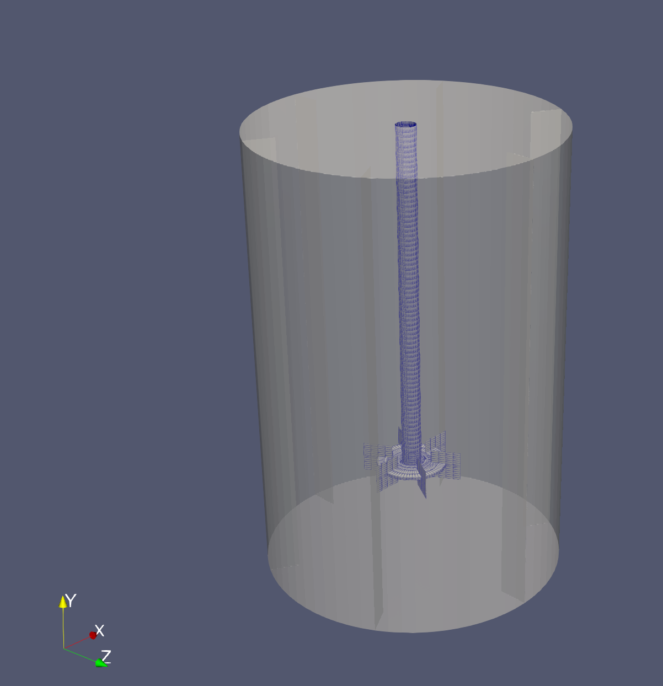
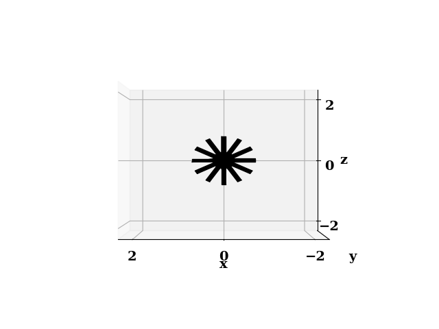
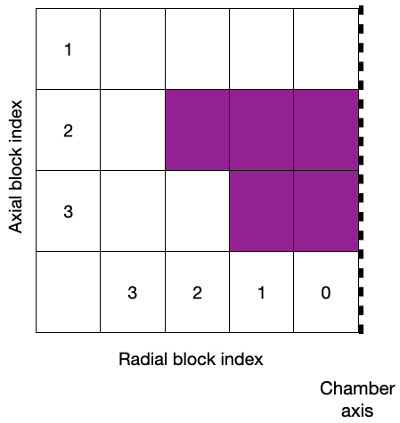
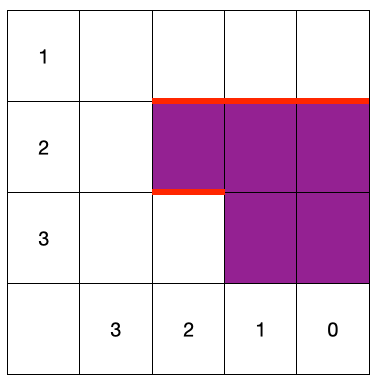
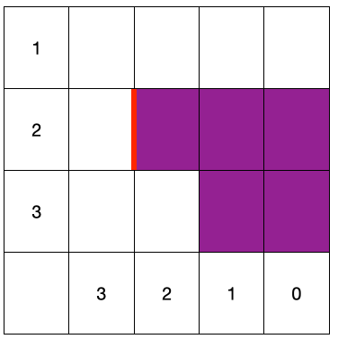
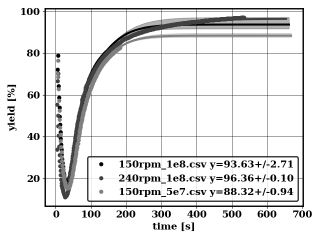

# Bio Reactor Design Toolbox [](https://github.com/NREL/BioReactorDesign/actions/workflows/ci.yml)


## Installation

```bash
conda create  --name brd python=3.10
conda activate brd
pip install -e .
```

## Meshing

### Generate Stir tank mesh

```bash
inp=brd/meshing/stir_tank_mesh_templates/base_tank/tank_par.yaml
out=brd/meshing/stir_tank_case_templates/base/system/blockMeshDict

python applications/write_stir_tank_mesh.py -i $inp -o $out
```

Generates a blockMeshDict

Then activate openFoam environement (tested with OpenFoam9) and mesh with

```bash
blockMesh -dict system/blockMeshDict
stitchMesh -perfect -overwrite inside_to_hub inside_to_hub_copy
stitchMesh -perfect -overwrite hub_to_rotor hub_to_rotor_copy
transformPoints "rotate=((0 0 1)(0 1 0))":
```
Mesh visualized in Paraview

<p float="left">
  
</p>


### Generate STL mesh

`python applications/write_stl_mesh.py -v -cr 0.25 -na 12 -aw 0.1 -al 0.5`

Generates

<p float="left">
  
</p>


### Manual

```
usage: write_stl_mesh.py [-h] [-cr] [-na] [-aw] [-al] [-v]

Generate Spider Sparger STL

optional arguments:
  -h, --help            show this help message and exit
  -cr , --centerRadius
                        Radius of the center distributor
  -na , --nArms         Number of spider arms
  -aw , --armsWidth     Width of spider arms
  -al , --armsLength    Length of spider arms
  -v, --verbose         plot on screen

```

### Block cyclindrical meshing

Generates `blockMeshDict` in `system`

```bash
root=`pwd`
caseFolder=brd/meshing/block_cyl_cases_templates/case
mesh_temp=brd/meshing/block_cyl_mesh_templates/sideSparger

python applications/write_block_cyl_mesh.py -i $mesh_temp/input.json -t $mesh_temp/topology.json -o $caseFolder/system
```

Then activate openFoam environement (tested with OpenFoam9) and mesh with

```bash
cd $caseFolder
blockMesh
transformPoints "scale=(0.001 0.001 0.001)"
transformPoints "rotate=((0 0 1) (0 1 0))"
cd $root
```

Will generate this

<p float="left">
  
</p>


#### How to change the dimensions or mesh refinement

All dimensions and mesh are controlled by the input file `input.json`. 
The input file can also be in `.yaml` format. The parser will decide the file format based on its extension. 
See `brd/meshing/block_cyl_mesh_templates/baseColumn/` for an example of `.yaml`

#### How to change the arrangement of concentric cylinders

The block topology is controlled by the `topology.json`
Always work with a schematic. Here is the schematic for this case

<p float="left">
  
</p>

The purple blocks are walls (not meshed) and the white blocks are fluid blocks (meshed). The symmetry axis is indicated as a dashed line

In the `topology.json`, the purple blocks are defined as

```
"Walls": {
                "Support": [
                            {"R": 0, "L": 3},
                            {"R": 1, "L": 3}
                           ],
                "Sparger": [
                            {"R": 0, "L": 2},
                            {"R": 1, "L": 2},
                            {"R": 2, "L": 2}
                           ]
        }
```

#### How to change boundaries

Boundaries are defined with three types, `top`, `bottom` and `lateral`

In the case of sparger walls shown below with the red lines
<p float="left">
  
</p>

the boundary is defined in the `topology.json` as
```
"Boundary": {
                "wall_sparger":[
                           {"type": "bottom", "Rmin": 2, "Rmax": 2, "Lmin": 2, "Lmax": 3},
                           {"type": "top", "Rmin": 0, "Rmax": 0, "Lmin": 1, "Lmax": 2},
                           {"type": "top", "Rmin": 1, "Rmax": 1, "Lmin": 1, "Lmax": 2},
                           {"type": "top", "Rmin": 2, "Rmax": 2, "Lmin": 1, "Lmax": 2}
                         ],
...
```

In the case of sparger inlet shown below with the red line
<p float="left">
  
</p>

the boundary is defined in the `topology.json` as
```
"Boundary": {
                "inlet": [
                           {"type": "lateral", "Rmin": 2, "Rmax": 3, "Lmin": 2, "Lmax": 2}
                         ],
...
```

#### Manual

```
usage: write_block_cyl_mesh.py [-h] -i  -t  -o

Block cylindrical meshing

options:
  -h, --help            show this help message and exit
  -i , --input_file     Input file for meshing and geometry parameters
  -t , --topo_file      Block description of the configuration
  -o , --output_folder 
                        Output folder for blockMeshDict
```
## Postprocess

### Perform early prediction

`python applications/earlyPredicition.py -df brd/postProcess/data_early`

Generates

<p float="left">
  
  
</p>

#### Manual

```
usage: early_prediction.py [-h] -df  [-func]

Early prediction

options:
  -h, --help            show this help message and exit
  -df , --dataFolder    Data folder containing multiple QOI time histories
  -func , --functionalForm 
                        functional form used to perform extrapolation
```


`cd conditionalMean`

follow `README.md`

### Plot conditional means

`cd conditionalMean`

follow `README.md`


## Preprocess

### Generate fi.gas

`cd inhomogeneousBC`

follow `README.md`


## Acknowledgments

This work was authored by the National Renewable Energy Laboratory (NREL), operated by Alliance for Sustainable Energy, LLC, for the U.S. Department of Energy (DOE) under Contract No. DE-AC36-08GO28308. This work was supported by funding from DOE's Bioenergy Technologies Office (BETO) program. The research was performed using computational resources sponsored by the Department of Energy's Office of Energy Efficiency and Renewable Energy and located at the National Renewable Energy Laboratory. The views expressed in the article do not necessarily represent the views of the DOE or the U.S. Government. The U.S. Government retains and the publisher, by accepting the article for publication, acknowledges that the U.S. Government retains a nonexclusive, paid-up, irrevocable, worldwide license to publish or reproduce the published form of this work, or allow others to do so, for U.S. Government purposes.


