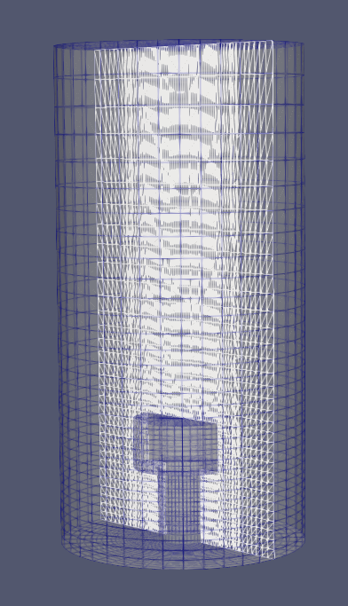

## Generate STL of spider sparger

### Execute without plotting

`python main.py -cr 0.25 -na 12 -aw 0.1 -al 0.5`

### Execute with plotting

`python main.py -v -cr 0.25 -na 12 -aw 0.1 -al 0.5`

Generates

<p float="left">
  
</p>


### Manual

```
usage: main.py [-h] [-cr] [-na] [-aw] [-al] [-v]

Generate Spider Sparger STL

optional arguments:
  -h, --help            show this help message and exit
  -cr , --centerRadius 
                        Radius of the center distributor
  -na , --nArms         Number of spider arms
  -aw , --armsWidth     Width of spider arms
  -al , --armsLength    Length of spider arms
  -v, --verbose         plot on screen

```

## Generate fi.gas

`cd inhomogeneousBC`

### Execute

Generates `fi.gas` in `IC_inhomo`. If `r<0.1` use pores of diameter `3e-5`. Gradually decrease the pore size to `2e-5` linearly.

`python main.py -rc 0.1 -re 1 -pi 3e-5 -po 2e-5 -xc 0 -zc 0 -ugs 0.01 -ds 0.15`

### Execute with logging

`python main.py -rc 0.1 -re 1 -pi 3e-5 -po 2e-5 -xc 0 -zc 0 -ugs 0.01 -ds 0.15 -v`

### Manual

```
usage: main.py [-h] [-v] [-rc] [-re] [-pi] [-po] [-xc] [-zc] [-ds] [-ugs]

Generate inhomogeneous boundary

optional arguments:
  -h, --help            show this help message and exit
  -v, --verbose         plot on screen
  -rc , --r_const       Constant radius value
  -re , --r_end         End radius value
  -pi , --pore_in       Pore diameter at center
  -po , --pore_out      Pore diameter at radius end
  -xc , --xcent         Column center x
  -zc , --zcent         Column center z
  -ds , --diam_sparger 
                        Sparger diameter
  -ugs , --superf_vel   Superficial velocity

```


## Generate 3D sparger

`cd blockMeshDesign`

### Execute

Generates `blockMeshDict` in `system`

`cd system`<br>
`python writeBlockMesh.py input`<br>
`cd ..`<br>


Will generate this

<p float="left">
  
</p>

### Generate OpenFOAM mesh

`blockMesh`
<br>
`transformPoints "scale=(0.001 0.001 0.001)"`


### How to change the dimensions

All dimensions are controlled by the input file `system/input`

### How to change the arrangement of concentric cylinders

Always work with a schematic. Here is the schematic for this case

<p float="left">
  
</p>

The purple blocks are walls (not meshed) and the white blocks are fluid blocks (meshed). The symmetry axis is indicated as a dashed line

In the code, the purple blocks are defined as

```
WallR=[]
WallL=[]
#Support
WallR.append(0)
WallL.append(3)
WallR.append(1)
WallL.append(3)
# Sparger
WallR.append(0)
WallL.append(2)
WallR.append(1)
WallL.append(2)
WallR.append(2)
WallL.append(2)
```

### How to change boundaries

Boundaries are defined with three types, `top`, `bottom` and `lateral`

In the case of sparger walls shown below with the red lines
<p float="left">
  
</p>

the boundary is implemented as 
```
BoundaryNames.append('SpargerWalls')
BoundaryType.append(['bottom', 'top', 'top', 'top'])
BoundaryRmin.append([2, 0, 1, 2])
BoundaryRmax.append([2, 0, 1, 2])
BoundaryLmin.append([2, 1, 1, 1])
BoundaryLmax.append([3, 2, 2, 2])
```

In the case of sparger inlet shown below with the red line
<p float="left">
  
</p>

the boundary is implemented as
```
BoundaryNames.append('SpargerInflow')
BoundaryType.append(['lateral'])
BoundaryRmin.append([2])
BoundaryRmax.append([3])
BoundaryLmin.append([2])
BoundaryLmax.append([2])
```


