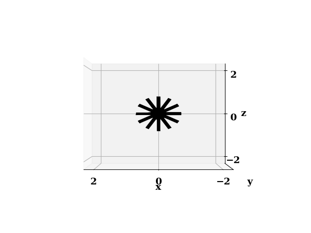

Preprocess
=====

.. _stl_patch:

Generate STL patch mesh
------------

Boundaries may be specified with ``surfaceToPatch`` utility in OpenFOAM, based on STL files that can be generated with

.. code-block:: console

   python applications/write_stl_patch.py -v

The verbose flag (``-v``) generates a plot of the stl mesh

.. _fig:stl_patch:

How to change the set of shapes in the boundary patch?
^^^^^^^^^^^^^^^

Edit the json files read when generating the mesh. In the case ``tutorial_cases/loop_reactor_mixing`` the boundary condition ``inlets`` consists of 3 discs

.. code-block:: json

   {
       "inlets": [
           {"type": "circle", "centx": 5.0, "centy": 0.0, "centz": 0.5, "radius": 0.4, "normal_dir": 1,"nelements": 50},
           {"type": "circle", "centx": 2.5, "centy": 0.0, "centz": 0.5, "radius": 0.4, "normal_dir": 1,"nelements": 50},
           {"type": "circle", "centx": 7.5, "centy": 0.0, "centz": 0.5, "radius": 0.4, "normal_dir": 1,"nelements": 50}
       ],
   }

Related tutorials
^^^^^^^^^^^^^^^

- ``tutorial_cases/loop_reactor_mixing``
- ``tutorial_cases/loop_reactor_reacting``
- ``tutorial_cases/bubble_column_20L``

